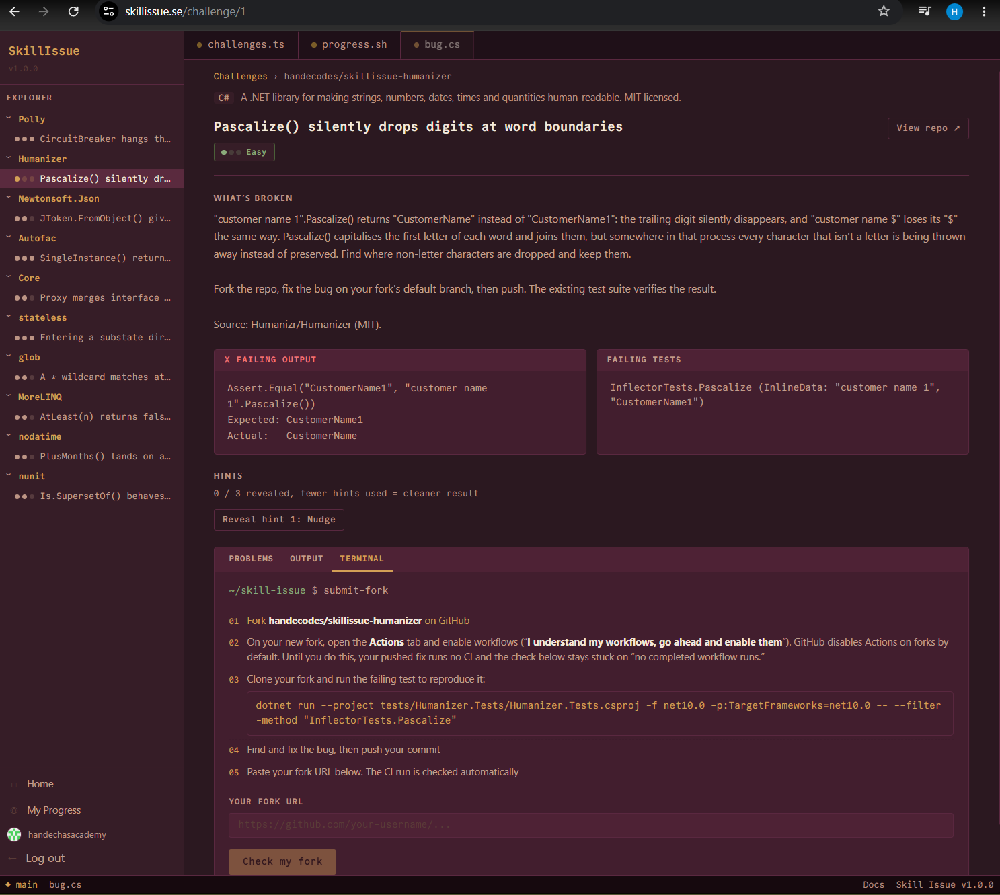
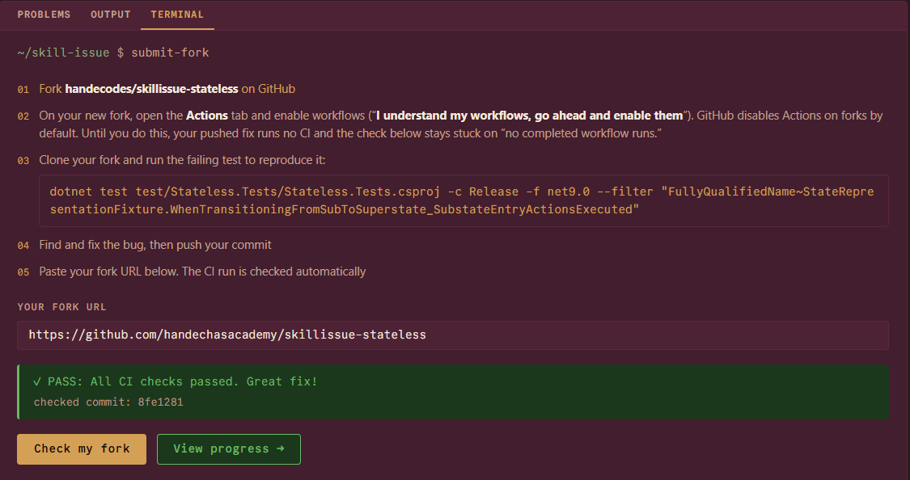

# Skill Issue

[](https://github.com/handecodes/SkillIssue/actions/workflows/ci.yml)
[](https://codecov.io/gh/handecodes/SkillIssue)

Debugging practice on real bugs from real open-source codebases. The kind of work the job actually involves.

Live at **[skillissue.se](https://skillissue.se)**

---

## What it is

A debugging trainer built on real .NET open-source libraries. School and tutorials teach you to write code from a blank file. They do not teach you to open a large codebase you have never seen, track down the one thing that is broken, and fix it without disturbing everything around it. That second skill is most of the job, and almost nobody practices it before they need it.

10 challenges across 10 real open-source .NET repositories. You get a failing test, a short description of the symptom with no location given, and three tiered hints. Fork the repo, find the bug, fix it, push. CI on your fork verifies the result.

Each bug is a real defect planted in a real library, caught by a test that already lives in that library's suite. Nothing is generated, nothing is simplified.

---

## Screenshots



_A challenge: the failing test, the symptom with no location given, tiered hints, and fork-to-verify instructions._



_Push your fix and the scoped CI run on your fork confirms it._

---

## Stack

- C# / .NET 10 LTS
- Blazor Server (interactive SSR over SignalR)
- Entity Framework Core with SQLite
- GitHub OAuth via AspNet.Security.OAuth.GitHub
- Docker (Linux container)
- Azure App Service

---

## Run locally

**Prerequisites**

- .NET 10 SDK
- A GitHub OAuth app ([create one here](https://github.com/settings/developers))
  - Callback URL: `https://localhost:7239/signin-github`

**Setup**

```bash
git clone https://github.com/handecodes/SkillIssue.git
cd SkillIssue
```

Set OAuth credentials via user-secrets. Do not commit these.

```bash
cd src/SkillIssue.Web
dotnet user-secrets set "GitHub:ClientId" "<your-client-id>"
dotnet user-secrets set "GitHub:ClientSecret" "<your-client-secret>"
```

Optionally, set a GitHub PAT to avoid rate limits on fork verification:

```bash
dotnet user-secrets set "GitHub:PatToken" "<your-pat>"
```

**GitHub secrets (CI only)**

After forking and connecting the repo to Codecov, add `CODECOV_TOKEN` as a repository secret under Settings > Secrets and variables > Actions. The CI workflow uploads coverage reports on every push to `main`.

**Run**

```bash
dotnet run --project src/SkillIssue.Web --launch-profile https
```

The database is created and seeded on first run. Open `https://localhost:7239`.

**Tests**

```bash
dotnet test
```

**Adding a migration after model changes**

```bash
dotnet ef migrations add <Name> \
  --project src/SkillIssue.Data \
  --startup-project src/SkillIssue.Web
```

---

## Project structure

```
src/
  SkillIssue.Domain/      Entities: User, Repo, Bug, HintTier, FailingTest, Attempt
  SkillIssue.Data/        EF Core DbContext, migrations, seeder
  SkillIssue.Application/ Services, models
  SkillIssue.Web/         Blazor Server app and Program.cs
tests/
  SkillIssue.Tests/       xUnit tests (in-memory SQLite, no external dependencies)
docs/
  adr/                    Architecture decision records
```

Dependency direction: `Web` -> `Application` -> `Data` -> `Domain`

---

## Known limitations

**SQLite write contention.** SQLite handles the current load but will hit contention under concurrent writes. The data layer is structured so a SQL Server migration requires only a connection string and provider swap, with no model changes needed.

**Ephemeral storage in the current deploy.** The SQLite file lives at `/data/skillissue.db` in the container. Azure App Service does not persist this across container restarts without a mounted persistent volume. The database resets on redeploy. Fixing this requires mounting an Azure Files share or switching to Azure SQL.

**No admin UI.** Adding or editing challenges requires a code change and redeployment. There is no web interface for managing the challenge library.

**CSP not implemented.** Blazor Server requires `unsafe-inline` scripts for its SignalR bootstrap. A meaningful Content-Security-Policy needs per-request nonce injection and has been deferred.

**No scale-to-zero handling.** Blazor Server circuits need a warm host. Cold-start latency is noticeable and not handled gracefully.

---

## Bug sources

| Library | License | Source repo |
|---------|---------|-------------|
| Humanizer | MIT | [Humanizr/Humanizer](https://github.com/Humanizr/Humanizer) |
| Polly | BSD 3-Clause | [App-vNext/Polly](https://github.com/App-vNext/Polly) |
| Castle.Core | Apache 2.0 | [castleproject/Core](https://github.com/castleproject/Core) |
| Newtonsoft.Json | MIT | [JamesNK/Newtonsoft.Json](https://github.com/JamesNK/Newtonsoft.Json) |
| Autofac | MIT | [autofac/Autofac](https://github.com/autofac/Autofac) |
| NUnit | MIT | [nunit/nunit](https://github.com/nunit/nunit) |
| Noda Time | Apache 2.0 | [nodatime/nodatime](https://github.com/nodatime/nodatime) |
| MoreLINQ | Apache 2.0 | [morelinq/MoreLINQ](https://github.com/morelinq/MoreLINQ) |
| Stateless | Apache 2.0 | [dotnet-state-machine/stateless](https://github.com/dotnet-state-machine/stateless) |
| GlobExpressions | MIT | [kthompson/glob](https://github.com/kthompson/glob) |

---

## How challenges are sourced

Each challenge is a platform-maintained fork of a real .NET library, kept under `handecodes/skillissue-*`. The bug is planted on the fork's default branch as a small, localized source change, and a scoped `challenge.yml` workflow runs only the test that catches it. Because that test already exists in the library, the default branch is genuinely failing from the start.

You fork the challenge repo, enable Actions on your fork, fix the bug on the default branch, and push. The scoped CI run is what verifies the fix. There is no commit to check out. You work in your own environment, the way you would on a real project. The reasoning behind this model, and what it replaced, is recorded in [ADR-008](docs/adr/ADR-008.md).

Difficulty reflects how hard the bug is to locate, not how complex the fix is. A one-character fix can be Hard if reproducing the symptom requires reading across multiple abstraction layers. A multi-file change can be Easy if the test failure message points directly at the problem. Tiered hints are calibrated to the navigation challenge, not the implementation challenge.
